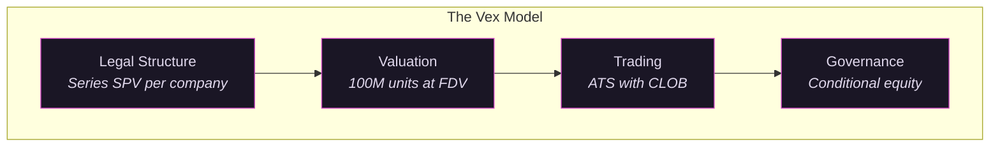
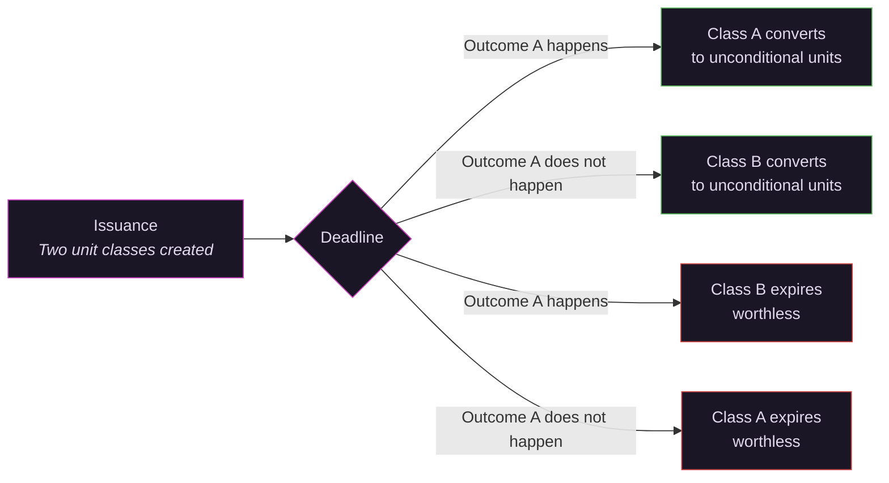
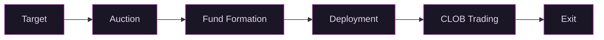
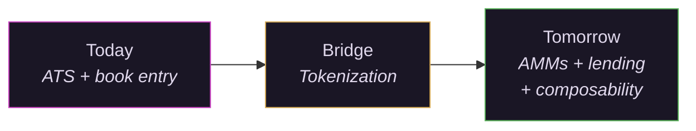

# Remaining Updates Implementation Plan

> **For agentic workers:** REQUIRED: Use superpowers:subagent-driven-development (if subagents available) or superpowers:executing-plans to implement this plan. Steps use checkbox (`- [ ]`) syntax for tracking.

**Goal:** Update the roadmap and strategy docs to reflect the permanent two-board model with fee structure and warehousing, add Mermaid diagrams and data charts to the whitepaper, and regenerate the PDF.

**Architecture:** Documentation edits across two repos (`~/vex-compliance-docs` and `~/vex-whitepaper`). Visuals are Mermaid diagrams (inline in markdown, rendered by Jekyll) and HTML/CSS data charts. Screenshots of all visuals go into `_assets/` for the PDF pipeline.

**Tech Stack:** Jekyll 4.x, just-the-docs theme, Mermaid 10, pandoc + pdflatex, Playwright (screenshots)

---

## File Structure

**~/vex-compliance-docs:**
- Modify: `docs/roadmap/index.md` (Phase 3 rewrite, fee model, warehousing, listing lifecycle section)
- Modify: `docs/strategy/2026-03-17-platform-strategy.md` (listing lifecycle, fee model, warehousing mechanics)

**~/vex-whitepaper:**
- Modify: `the-vex-model.md` (add 2 Mermaid diagrams)
- Modify: `how-it-works.md` (add 1 Mermaid diagram)
- Modify: `what-comes-next.md` (add 1 Mermaid diagram)
- Modify: `the-problem.md` (add 2 data charts)
- Modify: `why-now.md` (add 1 data chart)
- Modify: `_sass/custom/custom.scss` (add chart styles)
- Create: `_assets/diagram-four-layers.png`
- Create: `_assets/diagram-conditional-equity.png`
- Create: `_assets/diagram-lifecycle.png`
- Create: `_assets/diagram-progression.png`
- Create: `_assets/chart-pe-returns.png`
- Create: `_assets/chart-company-decline.png`
- Create: `_assets/chart-secondary-volume.png`
- Modify: `generate-pdf.sh` (named PNG references, chart HTML replacement)

---

## Chunk 1: Compliance Docs Updates

### Task 1: Roadmap Phase 3 rewrite and fee model

**Files:**
- Modify: `~/vex-compliance-docs/docs/roadmap/index.md:136-188` (Phase 3 section)
- Modify: `~/vex-compliance-docs/docs/roadmap/index.md:60-94` (Phase 1, add fee model)

**Writing rules:** Never use dashes as separators/punctuation. No LLM filler words. State facts plainly. See `feedback_ai_voice.md` in memory.

- [ ] **Step 1: Rewrite Phase 3**

Replace the current Phase 3 section (lines 136-188) with a batch graduation framing. The new Phase 3:

```markdown
## Phase 3: AI Board Launch and Batch Graduation (Q4 2026 or Q1 2027)

**Goal:** All existing 3(c)(7) funds file N-2 registration statements simultaneously. AI Board opens. Accredited investors can participate. Conditional equity and warehousing enabled.

### Product

- N-2 registration statement template built and tested
- **All existing QP Board Series file N-2s simultaneously** (batch graduation, not one at a time)
- Accredited investor onboarding flow (lower threshold: $200K income or $1M net worth for individuals)
- Board and CCO infrastructure for registered Series operational
- CLOB support for multiple unit classes per Series (needed for conditional equity)
- N-CEN and N-PORT filing automation
- **Warehousing flow live:** existing shareholders of a company convert their private shares into fund units. The Series issues new units as consideration to acquire the shares. The shareholder gets liquid, tradeable units on the CLOB. The fund increases its position. Available on AI Board only (registered securities enable immediate trading of new units).

### Regulatory

- **N-2 filed with SEC Division of Investment Management** for all existing Series
  - SEC initial comments within ~27 calendar days
  - Response rounds: 14 to 16 days each
  - For single-asset SPVs with no investment discretion, no portfolio turnover, no complex disclosures: minimal comments expected
  - N-2 is a template with one variable (which company's stock)
  - Realistic timeline to effectiveness: **2 to 3 months** from filing
  - Confidential review process available (SEC expanded March 2025)
  - Template subsequent filings off the first approved N-2
- **Board of directors seated:** 3 Vex officers + 2 independent directors (at least 40% independent required by Investment Company Act). Same board covers all registered SPVs.
- **CCO designated.** Reports directly to the board. Annual written report on compliance program.
- Written compliance policies and procedures adopted. Annual review committed.
- **N-CEN:** annually, within 75 days of fiscal year end
- **N-PORT:** monthly, within 30 days of month end, public 60 days after
- Investment Company Act restrictions take effect:
  - Leverage limits (300% asset coverage for debt, 200% for preferred)
  - Affiliated transaction restrictions (Section 17)
  - Capital structure limits
- Cost estimates:
  - Setup: $250K to $500K (N-2 template, board recruitment, compliance buildout). Amortized: first filing is expensive, subsequent filings are near-zero marginal cost.
  - Ongoing: $200K to $400K shared across all registered SPVs (independent directors, CCO, fund admin, audit)
  - Per-Series marginal cost: filing fee + Carta data pull

### Business Development

- All existing QP Board holders notified: their units are now registered securities, freely tradeable
- Marketing to accredited investor pool (much larger than QP pool)
- No minimum position sizes on AI Board (holder cap removed)
- Warehousing outreach to shareholders of companies in the portfolio
- Demonstrate demand from accredited investors for graduated tickers

### Graduation Trigger (for the first batch)

The first batch graduation happens when AI Board infrastructure is ready: board seated, CCO designated, N-2 template approved by SEC. All existing 3(c)(7) funds graduate at once.

### Dependencies

Phase 2 active. Board candidates identified and recruited. N-2 template prepared.
```

- [ ] **Step 2: Add fee model to Phase 1 Product section**

In Phase 1 (lines 60-94), add after the "First 10-K or 10-Q filed" bullet in the Product subsection:

```markdown
- **Fee model active:** 1% per year paid in unit dilution, starting 12 months after auction close. No carried interest. No 2/20. Vex Capital covers fund expenses during the initial period. After AI Board launches, ongoing expenses come from the 1%.
```

- [ ] **Step 3: Add Ongoing Listing Lifecycle section**

Add after the Risk Register table (end of file) as a new top-level section:

```markdown
---

## Ongoing Listing Lifecycle

After the AI Board launches, every new company follows the same path:

1. **Auction on QP Board.** Dutch auction conducted as a Reg D (domestic) and Reg S (offshore) offering. QPs bid. Auction clears at uniform price. Series SPV formed.
2. **Allocation.** Vex Capital deploys cash to acquire equity through primary and secondary channels.
3. **QP Board CLOB.** Series files 10-Ks and 10-Qs to become a reporting issuer. CLOB opens six months after auction close (Rule 144 for reporting issuers). Minimum position sizes enforced to manage the 2,000 holder cap.
4. **Graduation to AI Board.** Series files N-2 (templated off the first approval). When registration is effective, the Series moves to the AI Board. Holder cap removed. Accredited investors can participate. Warehousing and conditional equity enabled.

The QP Board is permanent. It is the pipeline for every new company, before and after the AI Board exists. QPs get early access to every company before it opens to the broader market.
```

- [ ] **Step 4: Verify and commit**

```bash
cd ~/vex-compliance-docs
bundle exec jekyll build 2>&1 | tail -5
git add docs/roadmap/index.md
git commit -m "feat: rewrite roadmap Phase 3 as batch graduation, add fee model and listing lifecycle"
```

### Task 2: Strategy document updates

**Files:**
- Modify: `~/vex-compliance-docs/docs/strategy/2026-03-17-platform-strategy.md`

- [ ] **Step 1: Add Listing Lifecycle subsection**

After the Graduation Criteria section (after line 87), add:

```markdown
### Listing Lifecycle

After the AI Board launches, every new company follows the same path:

1. Auction on QP Board (Reg D/S). QPs bid. Fund forms.
2. Vex Capital deploys cash to acquire equity.
3. Series files Ks and Qs. CLOB opens on QP Board after six-month Rule 144 holding period.
4. Series files N-2 (templated). Graduates to AI Board when registration is effective.

The first batch of existing 3(c)(7) funds graduates simultaneously when AI Board infrastructure is ready (board seated, CCO designated, first N-2 approved). After that, each new Series follows the path individually.

The QP Board does not shut down. It is the permanent pipeline for new companies. QPs get early access before graduation opens access to accredited investors.
```

- [ ] **Step 2: Add Warehousing Mechanics subsection**

Under the Accredited Investor Board heading, after the "Next-day warehousing for new unit classes" bullet (around line 56), add a new subsection:

```markdown
**Warehousing mechanics:**

An existing shareholder of the underlying company converts private shares into fund units. The Series issues new units as consideration to acquire the shares. The transaction:

- Shareholder delivers private stock to the Series SPV
- Series issues new fund units to the shareholder at fair value (409A from Carta)
- New units are registered securities (AI Board), tradeable immediately
- Dilutive to existing unit holders, but NAV-neutral: the fund's total equity position increases by the value of the new shares acquired
- Cost to the shareholder: the fund's 1% annual fee. Compare to the ~20% discount on back-channel secondary deals today.

Warehousing is available only on the AI Board. Registered securities can be issued and traded the next day. On the QP Board, new unit issuance would restart the Rule 144 holding period.
```

- [ ] **Step 3: Add Fee Model section**

After the Operational Standardization section (after line 113), add a new top-level section:

```markdown
---

## Fee Model

No carried interest. The fee is 1% per year, paid in unit dilution, starting 12 months after auction close.

That is the entire fee structure. No 2/20. No management fee plus carry. No performance allocation. One number.

**Mechanics:** The Series issues new units equal to 1% of outstanding units on the anniversary of auction close. These units accrue to Vex Capital as compensation.

**Initial period:** Vex Capital covers fund expenses (legal, accounting, filing fees, Carta data, transfer agent operations) until the AI Board launches. This means LPs pay zero in the first year (dilution starts at month 12) and zero in expenses during the QP Board phase.

**Post-AI Board:** Ongoing expenses come out of the 1%. The 1% covers Vex Capital compensation plus all fund operating costs.
```

- [ ] **Step 4: Verify and commit**

```bash
cd ~/vex-compliance-docs
bundle exec jekyll build 2>&1 | tail -5
git add docs/strategy/2026-03-17-platform-strategy.md
git commit -m "feat: add listing lifecycle, warehousing mechanics, and fee model to strategy doc"
```

---

## Chunk 2: Whitepaper Mermaid Diagrams

### Task 3: Four-layer model diagram

**Files:**
- Modify: `~/vex-whitepaper/the-vex-model.md`

- [ ] **Step 1: Add four-layer model diagram**

Add after the opening paragraph ("Vex standardizes four layers...") and before the "## Legal Structure" heading:



- [ ] **Step 2: Add conditional equity flow diagram**

Add after the paragraph ending "Both are real equity denominated in the same 100M unit standard." in the Governance section:



- [ ] **Step 3: Commit**

```bash
cd ~/vex-whitepaper
git add the-vex-model.md
git commit -m "feat: add four-layer model and conditional equity Mermaid diagrams"
```

### Task 4: Lifecycle and progression diagrams

**Files:**
- Modify: `~/vex-whitepaper/how-it-works.md`
- Modify: `~/vex-whitepaper/what-comes-next.md`

- [ ] **Step 1: Add lifecycle flow diagram to how-it-works.md**

Add after the "## The Private Beta" heading, before "### 1. Target":



- [ ] **Step 2: Add progression diagram to what-comes-next.md**

Add after the "## What exists today" section, before "## Tokenization is the bridge":



- [ ] **Step 3: Commit**

```bash
cd ~/vex-whitepaper
git add how-it-works.md what-comes-next.md
git commit -m "feat: add lifecycle and progression Mermaid diagrams"
```

---

## Chunk 3: Data Charts

### Task 5: Add chart styles to SCSS

**Files:**
- Modify: `~/vex-whitepaper/_sass/custom/custom.scss`

- [ ] **Step 1: Add chart CSS**

Add before the closing responsive media query section (before `@media (max-width: 800px)`):

```scss
// ============================================================
// Data charts
// ============================================================
.vex-chart {
  background: $vex-surface;
  border: 1px solid $vex-border;
  border-radius: 8px;
  padding: 2rem;
  margin: 2rem 0;
}

.vex-chart-title {
  font-family: 'DM Sans', sans-serif;
  font-size: 0.75rem;
  text-transform: uppercase;
  letter-spacing: 0.08em;
  color: $vex-text-dim;
  margin-bottom: 1.5rem;
}

.vex-chart-source {
  font-size: 0.75rem;
  color: $vex-text-dim;
  margin-top: 1rem;
  font-style: italic;
}

// Bar chart
.vex-bars {
  display: flex;
  align-items: flex-end;
  gap: 2rem;
  height: 200px;
  padding-bottom: 1.5rem;
  border-bottom: 1px solid rgba(255,255,255,0.1);
}

.vex-bar-group {
  flex: 1;
  display: flex;
  flex-direction: column;
  align-items: center;
  height: 100%;
  justify-content: flex-end;
}

.vex-bar {
  width: 60px;
  border-radius: 4px 4px 0 0;
  position: relative;
  transition: height 0.3s ease;
}

.vex-bar-value {
  position: absolute;
  top: -1.5rem;
  left: 50%;
  transform: translateX(-50%);
  font-family: 'Cormorant Garamond', serif;
  font-weight: 700;
  font-size: 1.1rem;
  color: #fff;
  white-space: nowrap;
}

.vex-bar-label {
  margin-top: 0.75rem;
  font-size: 0.8rem;
  color: $vex-text-dim;
  text-align: center;
}

// Trend chart (two-point or multi-point)
.vex-trend {
  display: flex;
  align-items: center;
  justify-content: space-between;
  padding: 1rem 0;
}

.vex-trend-point {
  text-align: center;
}

.vex-trend-value {
  font-family: 'Cormorant Garamond', serif;
  font-weight: 700;
  font-size: 2rem;
  color: #fff;
}

.vex-trend-label {
  font-size: 0.8rem;
  color: $vex-text-dim;
  margin-top: 0.25rem;
}

.vex-trend-arrow {
  font-size: 1.5rem;
  color: $vex-accent;
}
```

- [ ] **Step 2: Commit**

```bash
cd ~/vex-whitepaper
git add _sass/custom/custom.scss
git commit -m "feat: add chart styles for data visualizations"
```

### Task 6: PE vs public returns chart

**Files:**
- Modify: `~/vex-whitepaper/the-problem.md`

- [ ] **Step 1: Add chart HTML**

Add after the paragraph ending "This outperformance is persistent, well documented, and widely acknowledged. The interesting question is not whether it exists. It is why." and before "## The public penalty":

```html
<div class="vex-chart chart-pe-returns">
  <div class="vex-chart-title">Growth of $1 invested in 2015, measured through 2024</div>
  <div class="vex-bars">
    <div class="vex-bar-group">
      <div class="vex-bar" style="height: 79%; background: #c840c0;">
        <span class="vex-bar-value">$3.96</span>
      </div>
      <div class="vex-bar-label">Private Equity</div>
    </div>
    <div class="vex-bar-group">
      <div class="vex-bar" style="height: 70%; background: rgba(200,64,192,0.4);">
        <span class="vex-bar-value">$3.51</span>
      </div>
      <div class="vex-bar-label">S&P 500</div>
    </div>
    <div class="vex-bar-group">
      <div class="vex-bar" style="height: 52%; background: rgba(200,64,192,0.2);">
        <span class="vex-bar-value">$2.61</span>
      </div>
      <div class="vex-bar-label">MSCI World</div>
    </div>
  </div>
  <div class="vex-chart-source">Source: Hamilton Lane 2025 Market Overview</div>
</div>
```

- [ ] **Step 2: Commit**

```bash
cd ~/vex-whitepaper
git add the-problem.md
git commit -m "feat: add PE vs public returns chart"
```

### Task 7: Public company decline chart

**Files:**
- Modify: `~/vex-whitepaper/the-problem.md`

- [ ] **Step 1: Add chart HTML**

Add after the paragraph ending "The best companies have decided that trade is no longer worth making." and before "This is good for private equity returns.":

```html
<div class="vex-chart chart-company-decline">
  <div class="vex-chart-title">Number of U.S. public companies</div>
  <div class="vex-trend">
    <div class="vex-trend-point">
      <div class="vex-trend-value">~7,000</div>
      <div class="vex-trend-label">1996</div>
    </div>
    <div class="vex-trend-arrow">→</div>
    <div class="vex-trend-point">
      <div class="vex-trend-value">~3,500</div>
      <div class="vex-trend-label">2024</div>
    </div>
  </div>
  <div class="vex-chart-source">Source: Columbia Business School</div>
</div>
```

- [ ] **Step 2: Commit**

```bash
cd ~/vex-whitepaper
git add the-problem.md
git commit -m "feat: add public company decline chart"
```

### Task 8: Secondary market volume chart

**Files:**
- Modify: `~/vex-whitepaper/why-now.md`

- [ ] **Step 1: Add chart HTML**

Add after the paragraph ending "The demand for liquidity in private markets is not theoretical. It is $240 billion of revealed preference." and before "## The regulatory window is open":

```html
<div class="vex-chart chart-secondary-volume">
  <div class="vex-chart-title">Private market secondaries volume ($ billions)</div>
  <div class="vex-bars">
    <div class="vex-bar-group">
      <div class="vex-bar" style="height: 17%; background: rgba(200,64,192,0.2);">
        <span class="vex-bar-value">$40B</span>
      </div>
      <div class="vex-bar-label">2019</div>
    </div>
    <div class="vex-bar-group">
      <div class="vex-bar" style="height: 25%; background: rgba(200,64,192,0.3);">
        <span class="vex-bar-value">$60B</span>
      </div>
      <div class="vex-bar-label">2020</div>
    </div>
    <div class="vex-bar-group">
      <div class="vex-bar" style="height: 42%; background: rgba(200,64,192,0.4);">
        <span class="vex-bar-value">$100B</span>
      </div>
      <div class="vex-bar-label">2021</div>
    </div>
    <div class="vex-bar-group">
      <div class="vex-bar" style="height: 46%; background: rgba(200,64,192,0.5);">
        <span class="vex-bar-value">$110B</span>
      </div>
      <div class="vex-bar-label">2022</div>
    </div>
    <div class="vex-bar-group">
      <div class="vex-bar" style="height: 67%; background: rgba(200,64,192,0.65);">
        <span class="vex-bar-value">$160B</span>
      </div>
      <div class="vex-bar-label">2023</div>
    </div>
    <div class="vex-bar-group">
      <div class="vex-bar" style="height: 100%; background: #c840c0;">
        <span class="vex-bar-value">$240B</span>
      </div>
      <div class="vex-bar-label">2025</div>
    </div>
  </div>
  <div class="vex-chart-source">Source: McKinsey Global Private Markets Report / Jefferies</div>
</div>
```

Note: The intermediate year values ($60B, $100B, $110B, $160B) are approximate based on McKinsey/Jefferies reporting. The anchor points ($40B 2019, $240B 2025 at +48% YoY) are from the cited sources. The implementer should verify intermediate values if exact figures are available, or note them as approximate.

- [ ] **Step 2: Commit**

```bash
cd ~/vex-whitepaper
git add why-now.md
git commit -m "feat: add secondary market volume chart"
```

---

## Chunk 4: Screenshots and PDF

### Task 9: Screenshot all visuals

**Files:**
- Create: `~/vex-whitepaper/_assets/diagram-four-layers.png`
- Create: `~/vex-whitepaper/_assets/diagram-conditional-equity.png`
- Create: `~/vex-whitepaper/_assets/diagram-lifecycle.png`
- Create: `~/vex-whitepaper/_assets/diagram-progression.png`
- Create: `~/vex-whitepaper/_assets/chart-pe-returns.png`
- Create: `~/vex-whitepaper/_assets/chart-company-decline.png`
- Create: `~/vex-whitepaper/_assets/chart-secondary-volume.png`

- [ ] **Step 1: Verify Jekyll renders all visuals**

```bash
cd ~/vex-whitepaper
bundle exec jekyll serve &
sleep 3
curl -s http://localhost:4000/vex-whitepaper/the-problem.html | grep -c "chart-pe-returns"
curl -s http://localhost:4000/vex-whitepaper/the-problem.html | grep -c "chart-company-decline"
curl -s http://localhost:4000/vex-whitepaper/the-vex-model.html | grep -c "mermaid"
curl -s http://localhost:4000/vex-whitepaper/how-it-works.html | grep -c "mermaid"
curl -s http://localhost:4000/vex-whitepaper/what-comes-next.html | grep -c "mermaid"
curl -s http://localhost:4000/vex-whitepaper/why-now.html | grep -c "chart-secondary-volume"
```

All counts should be >= 1. If any are 0, the visual was not added correctly.

- [ ] **Step 2: Screenshot each visual using Playwright**

Use Playwright to navigate to each page and screenshot the specific elements:

```bash
mkdir -p ~/vex-whitepaper/_assets
```

Use the Playwright MCP browser tools:
1. Navigate to `http://localhost:4000/vex-whitepaper/the-vex-model.html`
2. Screenshot each Mermaid diagram (they render as `<pre class="mermaid">` elements)
3. Navigate to `http://localhost:4000/vex-whitepaper/the-problem.html`
4. Screenshot each `.vex-chart` element
5. Navigate to remaining pages, screenshot remaining visuals
6. Save each screenshot to `_assets/` with the filenames specified in the naming convention table

If Playwright is unavailable, manually screenshot from the browser and save to `_assets/`.

- [ ] **Step 3: Stop Jekyll server**

```bash
kill %1 2>/dev/null || true
```

- [ ] **Step 4: Commit screenshots**

```bash
cd ~/vex-whitepaper
git add _assets/
git commit -m "feat: add visual screenshots for PDF pipeline"
```

### Task 10: Update generate-pdf.sh

**Files:**
- Modify: `~/vex-whitepaper/generate-pdf.sh`

- [ ] **Step 1: Replace the `replace_mermaid` function with named image replacement**

Replace lines 33-50 of `generate-pdf.sh` with:

```bash
# Replace Mermaid code blocks with named PNG references
replace_mermaid() {
    local infile="$1"
    local outfile="$2"
    local diagram_index=0
    local -a diagram_names=("diagram-four-layers" "diagram-conditional-equity" "diagram-lifecycle" "diagram-progression")

    awk -v names="${diagram_names[*]}" '
    BEGIN { split(names, arr, " "); idx=0 }
    /^```mermaid/ {
        in_mermaid = 1
        idx++
        print ""
        next
    }
    in_mermaid && /^```/ {
        in_mermaid = 0
        next
    }
    in_mermaid { next }
    { print }
    ' "$infile" > "$outfile"
}
```

- [ ] **Step 2: Add chart HTML replacement function**

Add after the `replace_mermaid` function:

```bash
# Replace chart HTML blocks with PNG references
replace_charts() {
    local infile="$1"
    local outfile="$2"
    awk '
    /<div class="vex-chart chart-pe-returns">/ {
        in_chart = 1; depth = 1
        print ""
        next
    }
    /<div class="vex-chart chart-company-decline">/ {
        in_chart = 1; depth = 1
        print ""
        next
    }
    /<div class="vex-chart chart-secondary-volume">/ {
        in_chart = 1; depth = 1
        print ""
        next
    }
    in_chart && /<div/ { depth++; next }
    in_chart && /<\/div>/ {
        depth--
        if (depth <= 0) {
            in_chart = 0
        }
        next
    }
    in_chart { next }
    { print }
    ' "$infile" > "$outfile"
}
```

- [ ] **Step 3: Update the processing pipeline**

Replace the single `replace_mermaid` call (lines 62-63) with:

```bash
echo "Processing diagrams..."
PROCESSED="$TMPDIR/processed.md"
replace_mermaid "$COMBINED" "$PROCESSED"

echo "Processing charts..."
PROCESSED2="$TMPDIR/processed2.md"
replace_charts "$PROCESSED" "$PROCESSED2"
```

And update the pandoc command to use `$PROCESSED2` instead of `$PROCESSED`.

**Important:** The existing `append_page` function contains two sed lines that strip all `<div` and `</div>` lines:
```bash
| sed '/^<div /d' \
| sed '/^<\/div>/d' \
```
These were added to strip Kramdown-generated wrapper divs. They will also strip chart HTML, preventing `replace_charts` from matching anything. Change these two lines to only strip empty/Kramdown wrapper divs, not chart divs:
```bash
| sed '/^<div [^c]/d' \
| sed '/^<\/div>$/d' \
```
Wait, this is fragile. Better approach: **run `replace_charts` before `append_page`'s div stripping.** Since `append_page` runs during assembly and `replace_charts` runs after, restructure: move the div stripping out of `append_page` and into a separate step after `replace_charts`. Change `append_page` to remove the two sed lines. Add a new `strip_divs` step after `replace_charts`:
```bash
echo "Stripping remaining divs..."
PROCESSED3="$TMPDIR/processed3.md"
sed '/^<div /d; /^<\/div>/d' "$PROCESSED2" > "$PROCESSED3"
```
Then pass `$PROCESSED3` to pandoc.

- [ ] **Step 4: Copy _assets into tmpdir for pandoc**

Add before the pandoc command:

```bash
cp -r _assets "$TMPDIR/"
```

This is needed because pandoc runs in `$TMPDIR` and image paths are relative.

- [ ] **Step 5: Commit**

```bash
cd ~/vex-whitepaper
git add generate-pdf.sh
git commit -m "feat: update PDF pipeline for named diagram PNGs and chart HTML replacement"
```

### Task 11: Generate and verify PDF

- [ ] **Step 1: Generate PDF**

```bash
cd ~/vex-whitepaper
./generate-pdf.sh /tmp/vex-whitepaper.pdf
```

- [ ] **Step 2: Verify**

Open the PDF and check:
- Cover page renders (dark background, title, Vex branding)
- Table of contents present
- All 6 sections present with correct content
- 4 Mermaid diagram screenshots appear as images
- 3 data chart screenshots appear as images
- No raw Mermaid syntax (`\`\`\`mermaid`) in the output
- No raw HTML (`<div class="vex-chart"`) in the output

```bash
open /tmp/vex-whitepaper.pdf
```

- [ ] **Step 3: Copy final PDF to repo root and commit**

```bash
cd ~/vex-whitepaper
cp /tmp/vex-whitepaper.pdf ./vex-whitepaper.pdf
git add vex-whitepaper.pdf
git commit -m "feat: regenerate PDF with diagrams and data charts"
```

### Task 12: Push both repos

- [ ] **Step 1: Push compliance docs**

```bash
cd ~/vex-compliance-docs
git push origin main
```

- [ ] **Step 2: Push whitepaper**

```bash
cd ~/vex-whitepaper
git push origin main
```

- [ ] **Step 3: Verify Pages deploys**

```bash
cd ~/vex-whitepaper
gh run list --workflow=pages.yml --limit=1 --json status,conclusion
```

Wait for `"conclusion":"success"`.
