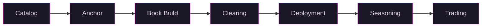

# Whitepaper and FAQ Update Implementation Plan

> **For agentic workers:** REQUIRED SUB-SKILL: Use superpowers:subagent-driven-development (recommended) or superpowers:executing-plans to implement this plan task-by-task. Steps use checkbox (`- [ ]`) syntax for tracking.

**Goal:** Restructure the whitepaper around the catalog/book build model and rewrite the platform FAQ to match.

**Architecture:** Seven markdown pages in a Jekyll static site (just-the-docs theme). Two pages are new (how-vex-works.md, why-this-model.md), two are deleted (the-vex-model.md, governance.md), and three are updated in place. The platform FAQ is a Go HTML template in a separate repo (~/potential-garbanzo). The PDF pipeline (generate-pdf.sh) must be updated for the new page order and filenames.

**Tech Stack:** Jekyll, Markdown, Mermaid diagrams, inline HTML charts, Pandoc/pdflatex PDF pipeline, Go HTML templates (FAQ)

**Spec:** `docs/superpowers/specs/2026-04-19-whitepaper-faq-update-design.md`

**Voice rules:** FINRA 2210 compliance (fair and balanced, cite sources, no promotional language, pair strengths with risks). No dashes as separators. No AI vocabulary cluster words. See `.claude/voice-check.md` for the full supplement and `~/.claude/plugins/cache/voice-check/voice-check/2.1.0/references/rules.md` for global rules.

**Disclaimer:** Every content page must end with the standard disclaimer paragraph. Copy it verbatim from the existing pages.

---

### Task 1: Update Home Page (index.md)

**Files:**
- Modify: `index.md`

The home page needs a new hook, updated value proposition, and restructured table of contents. Keep the three-entity description and the "Who this is for" section structure. Replace the auction-era framing with the catalog/book build model.

- [ ] **Step 1: Read the current index.md**

Read `index.md` to confirm the current content matches what's in the plan.

- [ ] **Step 2: Rewrite the opening paragraph**

Replace the current opening:

```
Vex opens private markets to every qualified investor: the pricing, liquidity, and governance that only VCs get today, available through SEC registered infrastructure.

Private markets have historically outperformed because the best companies avoid the public penalty: SOX compliance, quarterly earnings pressure, governance drag. But private markets impose their own penalty: illiquidity, opacity, GP control over exit timing, capital locked for a decade or longer. Vex eliminates the private penalty without importing the public one. The mechanism: standardized legal structure, valuation, trading, and governance on a single platform.
```

With new copy that:
- Leads with the demand-driven thesis: investors browse a catalog of private companies, signal demand with capital, and set the price through an open book build
- States that Vex structures SPVs around demonstrated investor demand, not fund manager picks
- Mentions the catalog, anchor commitment ($1M+), and open book build with uniform clearing price
- Names the key parameters: $10K minimum bid, 1% annual fee (no carry), 5% seller commission, 12-month seasoning, secondary trading on ATS
- Pairs value propositions with risks: illiquidity during seasoning, no guaranteed secondary market, capital at risk, SPV may partially deploy or refund
- Keeps the title "The Case for Standardized Private Markets" or updates it if a better framing emerges from the demand-driven thesis

- [ ] **Step 3: Keep the three-entity section unchanged**

The "The Vex Platform" section with Vex Securities, Vex Capital, and Vex Registry descriptions stays as-is. Do not modify.

- [ ] **Step 4: Update the "Who this is for" section**

Update the allocator line to reference the catalog and book build instead of implying continuous trading is available immediately. Keep "1% annual fee, no carried interest." Keep the companies/shareholders line. Keep the investors-in-Vex line.

- [ ] **Step 5: Rewrite the table of contents**

Replace the current 7-item contents list with the new page structure:

1. The Problem: (keep existing description, it still works)
2. How Vex Works: Full lifecycle from catalog browsing through anchor commitment, open book build, deployment, seasoning, and secondary trading.
3. Why This Model: Structural arguments for demand-driven pricing, transparent book builds, and regulated infrastructure over traditional fund structures.
4. What Comes Next: Conditional equity for governance and tokenization for distribution, both on the roadmap.
5. Why Now: (keep existing description, it still works)
6. Get Started: (update to remove "infrastructure is live" if misleading, keep practical)

Update the `href` values to match the new filenames: `how-vex-works.html`, `why-this-model.html`.

- [ ] **Step 6: Update the subtitle line**

Replace `[Vex Summit, April 11, SF](https://vexsummit.com)` with a reference to the summit as a past event, or remove it from the subtitle and let Get Started handle it.

- [ ] **Step 7: Run voice-check**

```bash
python3 ~/.claude/plugins/cache/voice-check/voice-check/2.1.0/engine/voice_check.py index.md
```

Fix any violations.

- [ ] **Step 8: Commit**

```bash
git add index.md
git commit -m "docs: rewrite home page for catalog/book build model"
```

---

### Task 2: Update The Problem (the-problem.md)

**Files:**
- Modify: `the-problem.md`

This page is mostly intact. The structural critique, data, and charts all still apply. The only change is sharpening the thesis section at the end to set up the demand-driven solution.

- [ ] **Step 1: Read the current the-problem.md**

Read `the-problem.md` to confirm content.

- [ ] **Step 2: Rewrite the thesis section**

The current thesis section (starting "The Vex thesis:") references "standardized legal structure, valuation, trading, and governance on a single platform" and explains the 3(c)(7) exemption and fungibility argument.

Rewrite to:
- Keep the 3(c)(7) exemption explanation (it's still the legal foundation)
- Keep the fungibility/market/price-discovery/liquidity chain of reasoning
- Add the demand-driven angle: instead of a fund manager selecting deals and running auctions, qualified investors browse a catalog and commit capital. When enough demand concentrates on a company, the SPV forms around that demand. The market itself determines what gets structured and at what price.
- Do not remove existing cited statistics or data
- Do not modify the charts or any section above "The thesis"

- [ ] **Step 3: Run voice-check**

```bash
python3 ~/.claude/plugins/cache/voice-check/voice-check/2.1.0/engine/voice_check.py the-problem.md
```

Fix any violations.

- [ ] **Step 4: Commit**

```bash
git add the-problem.md
git commit -m "docs: sharpen thesis section for demand-driven model"
```

---

### Task 3: Create How Vex Works (how-vex-works.md)

**Files:**
- Create: `how-vex-works.md`
- Reference: `the-vex-model.md` (for content to absorb), `how-it-works.md` (for content to absorb)

This is the centerpiece new page. It replaces both "The Vex Model" and "How It Works" with a single lifecycle walkthrough.

- [ ] **Step 1: Read source pages**

Read `the-vex-model.md` and `how-it-works.md` to identify content to carry forward, adapt, or drop.

Content to carry forward:
- Legal structure explanation (Series SPV per company, one entity type, one set of docs, weeks to launch)
- Valuation explanation (100M units at FDV, unit price = implied FDV, no preference stacks)
- The tradeoff acknowledgment (give up preferred terms, gain liquidity and price discovery)
- ATS description (SEC registered, Vex Securities CRD #317371, FINRA/SIPC)
- Unit vs. equity distinction (what trades is units in the Series, not the underlying company equity)
- Fees section (1% annual dilution starting 12 months after close, 5% seller commission, no carry)
- Warehousing section (shareholders converting private shares to fund units)

Content to drop:
- Dutch auction references (all of them)
- "Private Beta" / "Full Platform" split (replace with the unified lifecycle)
- "Broader access" / accredited investor graduation (not part of current model)
- "Public advertising" section
- Governance markets section (moves to What Comes Next)
- The old lifecycle Mermaid diagram (Target > Auction > Fund Formation > etc.)
- The old four-layers Mermaid diagram (replaced with lifecycle diagram)

Content to add:
- Catalog description (browsing, research summaries, starring, search)
- Anchor commitment ($1M+ triggers SPV formation, cash hold, countersign deadline)
- Open book build ($10K minimum bids, max FDV per bid, live demand curve, binding/non-cancellable, pseudonymous)
- Clearing mechanics (operator sets cap, uniform clearing price, pro-rata at margin, excluded bids refunded)
- Deployment outcomes (full, partial, none/refund)
- Seasoning (12-month Rule 144, or shorter with Form 10)
- Secondary trading on CLOB (no fee claims, execution depends on counterparty availability)

- [ ] **Step 2: Write the page with frontmatter**

Create `how-vex-works.md` with:

```yaml
---
layout: default
title: "How Vex Works"
nav_order: 3
---
```

Write the full page content following this structure:

1. Brief intro (2-3 sentences establishing the lifecycle concept)
2. New Mermaid lifecycle diagram:



Use the same Mermaid style tokens (fill:#1a1625, stroke:#c840c0, color:#e0d8ec) as the existing diagrams.

3. **Catalog** section: Hundreds of private companies with research summaries covering funding history, valuation, stage, and sector. Investors browse, search by sector or stage, and star companies to track interest. Content is maintained and updated. This is discovery, not a recommendation.

4. **Anchor** section: When an investor commits $1M+ to a company in the catalog, it triggers SPV formation. Vex Capital structures a 3(c)(7) Series SPV with standardized documents: master PPM, series supplement, subscription agreement. Cash is held until the anchor countersigns within a set deadline. If the anchor withdraws, the commitment is released. Weave in the legal standardization layer here: one entity type, one set of docs, one compliance framework, new Series in weeks not months.

5. **Book build** section: Once the SPV is structured and documents are ready, the deal opens to all qualified investors. Minimum bid: $10K. Each bid specifies a maximum fully diluted valuation (FDV). Bids are binding and non-cancellable (investors can raise their bid or place additional bids, but cannot withdraw). A live demand curve shows aggregate interest: the x-axis is candidate clearing FDV, the y-axis is cumulative USD from bids. Participation is pseudonymous (identity visible only to the operator and compliance). Weave in the valuation standardization layer: 100M units at FDV, one unit = one hundred-millionth of FDV, no preference stacks, no liquidation waterfalls.

6. **Clearing** section: The operator sets a cap on total raise (finalized_max_usd). The clearing algorithm sorts bids by max FDV descending and walks cumulative USD until the cap is reached. Bids above the clearing FDV are excluded (cash holds released). Bids at or below the clearing FDV are filled at the uniform clearing price. The marginal bidder may receive a pro-rata allocation. The result: one price for all investors.

7. **Deployment** section: Vex Capital sources equity in the target company through secondary purchases from existing shareholders or primary issuance from the company. Three outcomes:
   - Full: deployed capital meets or exceeds the target. All bidders receive full allocation. Any overshoot is rebated pro-rata.
   - Partial: deployed capital falls short. All allocations are scaled down proportionally. The remainder is refunded.
   - None: the operator marks the SPV as refunded. All cash holds are released and the SPV is wound down.
   Settlement is recorded on the transfer agent registry (Vex Registry).

8. **Seasoning** section: After deployment, units enter a 12-month holding period under SEC Rule 144. If the Series files Form 10 with the SEC, the holding period may be shorter. During seasoning, units cannot be traded.

9. **Trading** section: After seasoning, units become tradable on the ATS operated by Vex Securities. The secondary market uses a continuous limit order book (CLOB). Holders can place sell orders at any time. Execution depends on counterparty availability at an acceptable price. What trades on the ATS are units in the Series, not the underlying company equity. Transfer restrictions live at the SPV level, not the unit level. Unit transfers carry no company-level right of first refusal, no board approval, no notice period.

10. **Warehousing** section: Carry forward from the-vex-model.md. Existing shareholders can convert private shares into fund units. The Series issues new units as consideration to acquire the shares. The shareholder gets tradable units with access to the secondary market. The cost is the fund's 1% annual fee. For a shareholder sitting on restricted stock with no market, 1% is a fraction of the discount they would pay selling through secondary deals, which historically average 20% or more off NAV.

11. **Fees** section: Carry forward from how-it-works.md with updates.
    - 1% annual fee paid in unit dilution (0.25% of outstanding units per quarter end), starting 12 months after the book build closes. No carried interest. No management fee. Compare to the industry standard 2/20.
    - 5% commission on equity acquisitions, paid by the selling shareholder, not by fund investors.
    - Do NOT make claims about CLOB trading fees. The current how-it-works.md says "ATS matching fees for secondary trading on the CLOB will be published before the platform opens for trading." Keep similar language or omit.
    - Vex Capital covers fund expenses during the initial period.

12. Standard disclaimer paragraph at the end.

- [ ] **Step 3: Run voice-check**

```bash
python3 ~/.claude/plugins/cache/voice-check/voice-check/2.1.0/engine/voice_check.py how-vex-works.md
```

Fix any violations.

- [ ] **Step 4: Commit**

```bash
git add how-vex-works.md
git commit -m "docs: create How Vex Works page with catalog/book build lifecycle"
```

---

### Task 4: Create Why This Model (why-this-model.md)

**Files:**
- Create: `why-this-model.md`

The structural argument page. Why demand-driven beats alternatives.

- [ ] **Step 1: Write the page with frontmatter**

Create `why-this-model.md` with:

```yaml
---
layout: default
title: "Why This Model"
nav_order: 4
---
```

Write the full page with these sections:

1. **Brief intro** (2-3 sentences): The catalog/book build model is a design choice. This page explains why.

2. **Demand-driven deal formation**: Traditional private market funds start with a GP picking companies and raising capital against that thesis. Vex inverts this. The catalog presents hundreds of companies. Investors signal interest by starring and browsing. When an investor commits $1M+ as an anchor, SPV formation begins. Real capital triggers deal formation, not a fund manager's conviction. The result: the market surfaces what is worth structuring.

3. **Transparent pricing**: In a traditional secondary transaction, price is negotiated bilaterally with significant information asymmetry. The seller knows more than the buyer about why they are selling. The broker takes a spread. Settlement takes weeks.
   In a Vex book build, every qualified investor sees the same demand curve. Bids are binding. The clearing price is uniform: every filled investor pays the same price. No one overpays relative to their peers. The price reflects aggregate demand, not one counterparty's negotiating leverage.
   Risk to acknowledge: the clearing price is set by investor demand, not by audited financials or independent valuation. Private company valuations are subjective. Investors should conduct their own due diligence.

4. **Cost structure**: 1% annual dilution fee, accrued quarterly as unit issuance (not a cash charge to investors). 5% seller commission on equity acquisitions, paid by the selling shareholder. No carried interest. No management fee.
   Context: the industry standard is 2/20 (2% management fee compounding annually regardless of performance, plus 20% carry on gains). A $100M fund at 2/20 costs investors $2M/year in management fees before any performance. The same fund on Vex costs $1M/year in dilution, with no carry.
   Risk to acknowledge: the 1% dilution reduces each investor's proportional ownership over time. This is a real cost, not a fee waiver.

5. **Regulated infrastructure, not a fund**: Vex is three regulated entities operating a platform, not a fund with a thesis. Vex Securities (FINRA/SIPC broker-dealer) operates the ATS. Vex Capital (exempt reporting adviser) manages SPVs. Vex Registry (SEC-registered transfer agent) maintains ownership records. Each Series SPV is a separate fund, but the infrastructure is standardized across all of them.

6. **What can go wrong**: No guarantee of secondary liquidity after seasoning (execution depends on counterparty availability). 12-month seasoning lockup (or shorter with Form 10). Capital at risk: the SPV may partially deploy or fail to deploy entirely, resulting in scaled-down allocation or full refund. Catalog research is informational and does not constitute a recommendation. Each SPV holds equity in a single company, concentrating risk.

7. Standard disclaimer paragraph.

- [ ] **Step 2: Run voice-check**

```bash
python3 ~/.claude/plugins/cache/voice-check/voice-check/2.1.0/engine/voice_check.py why-this-model.md
```

Fix any violations.

- [ ] **Step 3: Commit**

```bash
git add why-this-model.md
git commit -m "docs: create Why This Model page with structural arguments"
```

---

### Task 5: Update What Comes Next (what-comes-next.md)

**Files:**
- Modify: `what-comes-next.md`
- Reference: `governance.md` (for content to fold in)

This page absorbs the governance concept from governance.md and keeps the existing tokenization content. Both are clearly framed as future capabilities.

- [ ] **Step 1: Read governance.md and what-comes-next.md**

Read both pages. Identify governance content to fold in.

From governance.md, carry forward:
- The conditional equity concept (two unit classes, deadline, conversion/expiration)
- The conditional equity Mermaid diagram
- The "what this replaces" argument (board seats, LP advisory committees, side letters)
- The management signal argument (dollar-weighted, real-time)
- The "what this is not" framing (not hostile, everyone long the company)

Drop the worked example (SaaS company pivot scenario) or condense it to one sentence.

- [ ] **Step 2: Rewrite the page**

Structure:

1. **Intro**: The ATS, catalog, and book build infrastructure are live. Two additional capabilities are on the roadmap. Both build on the standardized SPV and trading infrastructure already in place. Neither is a current offering.

2. **Governance through conditional equity**: New section, content from governance.md. Conditional unit classes that encode competing outcomes around governance questions. Both classes are real equity in the same 100M unit standard. If one outcome happens before the deadline, that class converts to standard units. The other expires worthless. The relative price is the market's probability estimate and implied valuation under each scenario.
   What this replaces: board seats (limited, go to largest LPs), LP advisory committees (non-binding), side letters (bilateral, opaque).
   Why management should want it: real-time, dollar-weighted signal on what the market thinks their decisions are worth.
   Include the conditional equity Mermaid diagram from governance.md (same style tokens).
   Frame clearly: "This capability is under development. It is not a current offering."

3. **What exists today**: Keep the existing paragraph about book entries at Vex Registry, Solana USDC, Mercury wire, transfer agent settlement. Update if any details have changed.

4. **Tokenization is the bridge**: Keep existing content mostly intact. Same units, same legal structure, same compliance. Distribution upgrade, not a philosophical shift. Keep the disclaimer about Vex Securities not facilitating tokenized unit sales.

5. **What tokenization would enable**: Keep the four sub-sections (AMM liquidity, lending, composability, cross-chain settlement). These are already properly hedged as "potential future capabilities."

6. **The regulatory path is clearing**: Keep existing content (GENIUS Act, SEC custody modernization).

7. **The numbers**: Keep existing content ($33B tokenized RWAs, 11% PE participants considering).

8. Update the Mermaid progression diagram. Currently shows "Today (ATS + book entry) > Bridge (Tokenization) > Tomorrow (AMMs + lending + composability)." Add governance to the progression or adjust the diagram to show both governance and tokenization as future steps.

9. Standard disclaimer paragraph.

- [ ] **Step 3: Update nav_order**

Change nav_order from 6 to 5 in the frontmatter.

- [ ] **Step 4: Run voice-check**

```bash
python3 ~/.claude/plugins/cache/voice-check/voice-check/2.1.0/engine/voice_check.py what-comes-next.md
```

Fix any violations.

- [ ] **Step 5: Commit**

```bash
git add what-comes-next.md
git commit -m "docs: fold governance into What Comes Next as future capability"
```

---

### Task 6: Update Why Now (why-now.md)

**Files:**
- Modify: `why-now.md`

Mostly intact. Update auction references and add a note about the catalog/book build model scaling with demand.

- [ ] **Step 1: Read the current why-now.md**

Read to confirm content and identify any auction references.

- [ ] **Step 2: Update auction references**

Scan for any mention of "auction," "Dutch auction," or auction-era mechanics. Replace with catalog/book build language where appropriate.

The current page does not directly mention auctions (it references secondaries data, regulatory environment, and technology readiness). But check the "structural backdrop" section: "Retail qualified purchasers want access but have no standardized way in" could be updated to reference the catalog as the standardized way in.

- [ ] **Step 3: Add demand-driven scaling note**

In the "structural backdrop" section or as a brief addition, note that the catalog/book build model scales with investor demand rather than requiring Vex to pre-commit to specific deals. As more investors join the platform, more companies attract anchor commitments, and more SPVs form. The infrastructure handles the scaling; no fund raise is needed per deal.

- [ ] **Step 4: Update nav_order**

Change nav_order from 7 to 6 in the frontmatter.

- [ ] **Step 5: Run voice-check**

```bash
python3 ~/.claude/plugins/cache/voice-check/voice-check/2.1.0/engine/voice_check.py why-now.md
```

Fix any violations.

- [ ] **Step 6: Commit**

```bash
git add why-now.md
git commit -m "docs: update Why Now for catalog/book build model"
```

---

### Task 7: Update Get Started (get-started.md)

**Files:**
- Modify: `get-started.md`

Update CTAs, summit reference, and remove auction-era language.

- [ ] **Step 1: Read the current get-started.md**

Read to confirm content.

- [ ] **Step 2: Update the allocator section**

Replace "Continuous liquidity, real price discovery, 1% annual fee, no carried interest" with language that accurately describes the catalog/book build model. Investors browse the catalog, commit capital through anchor commitments or book build bids, and access secondary trading after the 12-month seasoning period. Keep "1% annual fee, no carried interest."

Replace "You can place sell orders on the order book at any time; execution depends on counterparty availability at an acceptable price" with language that clarifies this applies after the seasoning period.

Keep QP thresholds ($5M+ individuals, $25M+ institutions).

Remove "When the full platform launches, you are already positioned: early access to every company before it opens to the broader market." This references the old private-beta/full-platform split which no longer applies.

- [ ] **Step 3: Update the companies/shareholders section**

Replace the warehousing reference link from `the-vex-model.html#warehousing` to `how-vex-works.html#warehousing`. Keep the rest of the content.

- [ ] **Step 4: Update the summit section**

Change from future event to past event:

Replace:
```
## Vex Private Markets Summit

April 11, 2026. Fort Mason Center, San Francisco. LP liquidity, tokenization, governance markets, and private stock trading. Robin Hanson on futarchy. Limited to 120 attendees.

[vexsummit.com](https://vexsummit.com)
```

With something like:
```
## Vex Private Markets Summit

Vex launched at its inaugural Private Markets Summit on April 11, 2026 at Fort Mason Center in San Francisco, featuring Robin Hanson on futarchy. For updates on future events, visit [vexsummit.com](https://vexsummit.com).
```

- [ ] **Step 5: Update internal links**

The "platform" section references are fine (they point to external BrokerCheck/FINRA URLs). But check for any links to `the-vex-model.html` or `governance.html` and update them:
- `the-vex-model.html` references should point to `how-vex-works.html`
- `governance.html` references should point to `what-comes-next.html`

- [ ] **Step 6: Update nav_order**

Change nav_order from 8 to 7 in the frontmatter.

- [ ] **Step 7: Run voice-check**

```bash
python3 ~/.claude/plugins/cache/voice-check/voice-check/2.1.0/engine/voice_check.py get-started.md
```

Fix any violations.

- [ ] **Step 8: Commit**

```bash
git add get-started.md
git commit -m "docs: update Get Started with catalog model and past summit reference"
```

---

### Task 8: Delete Old Pages

**Files:**
- Delete: `the-vex-model.md`
- Delete: `governance.md`
- Delete: `how-it-works.md`

- [ ] **Step 1: Verify all content has been absorbed**

Before deleting, confirm that all content from these three pages has been carried forward into the new pages:

- `the-vex-model.md` content:
  - Legal structure section > how-vex-works.md (Anchor section)
  - Valuation section > how-vex-works.md (Book build section)
  - Trading section > how-vex-works.md (Trading section)
  - Governance section > what-comes-next.md
  - Warehousing section > how-vex-works.md (Warehousing section)

- `how-it-works.md` content:
  - Lifecycle steps > how-vex-works.md (full lifecycle)
  - Fees section > how-vex-works.md (Fees section)
  - Full platform features > dropped (private-beta/full-platform split removed) except warehousing and governance which moved

- `governance.md` content:
  - All content > what-comes-next.md (Governance section)

- [ ] **Step 2: Delete the files**

```bash
git rm the-vex-model.md governance.md how-it-works.md
```

- [ ] **Step 3: Scan all remaining pages for broken links**

Search all .md files for references to the deleted pages:

```bash
grep -r "the-vex-model\|governance\.html\|how-it-works" *.md
```

Fix any broken links found:
- `the-vex-model.html` > `how-vex-works.html`
- `governance.html` > `what-comes-next.html`
- `how-it-works.html` > `how-vex-works.html`

- [ ] **Step 4: Commit**

```bash
git add -A
git commit -m "docs: remove old pages absorbed into new structure"
```

---

### Task 9: Update PDF Pipeline (generate-pdf.sh)

**Files:**
- Modify: `generate-pdf.sh`

The PDF pipeline assembles pages in a defined order and maps Mermaid diagrams by position. Both need updating.

- [ ] **Step 1: Read generate-pdf.sh**

Read the current file to confirm content.

- [ ] **Step 2: Update page order**

Replace the page assembly section:

```bash
# Old:
append_page "the-problem.md"
append_page "the-vex-model.md"
append_page "how-it-works.md"
append_page "governance.md"
append_page "what-comes-next.md"
append_page "why-now.md"
append_page "get-started.md"

# New:
append_page "the-problem.md"
append_page "how-vex-works.md"
append_page "why-this-model.md"
append_page "what-comes-next.md"
append_page "why-now.md"
append_page "get-started.md"
```

- [ ] **Step 3: Update Mermaid diagram names**

The `replace_mermaid()` function uses positional names. The old names list was:

```
diagram-four-layers diagram-conditional-equity diagram-lifecycle diagram-progression
```

Count the Mermaid diagrams in the new page order and assign names:

1. `how-vex-works.md`: lifecycle diagram (Catalog > Anchor > Book Build > ...) = `diagram-lifecycle`
2. `what-comes-next.md`: conditional equity diagram (from governance.md) = `diagram-conditional-equity`
3. `what-comes-next.md`: progression diagram (Today > Bridge > Tomorrow) = `diagram-progression`

Update the names variable:

```bash
local names="diagram-lifecycle diagram-conditional-equity diagram-progression"
```

Note: `diagram-four-layers` is dropped (the old four-layers stack diagram no longer exists). The old `_assets/diagram-four-layers.png` can remain in the assets directory (it won't be referenced).

- [ ] **Step 4: Verify chart replacements still work**

The `replace_charts()` function matches specific CSS class names in div tags. The charts are all in `the-problem.md` and `why-now.md`, which are unchanged. Confirm the three chart class names still appear:
- `chart-pe-returns` (in the-problem.md)
- `chart-company-decline` (in the-problem.md)
- `chart-secondary-volume` (in why-now.md)

No changes needed to `replace_charts()`.

- [ ] **Step 5: Commit**

```bash
git add generate-pdf.sh
git commit -m "docs: update PDF pipeline for new page structure"
```

---

### Task 10: Update _assets for New Diagrams

**Files:**
- Create: `_assets/diagram-lifecycle.png` (placeholder or screenshot)

The PDF pipeline needs a PNG for the new lifecycle Mermaid diagram. The old `diagram-four-layers.png` and `diagram-lifecycle.png` (if it exists from the old auction lifecycle) need to be replaced.

- [ ] **Step 1: Check existing assets**

```bash
ls _assets/
```

Identify which PNGs exist and which need updating.

- [ ] **Step 2: Document what needs manual capture**

The following PNGs need to be manually captured from the running Jekyll site after all content changes are complete:

- `_assets/diagram-lifecycle.png`: Screenshot of the new lifecycle Mermaid diagram (Catalog > Anchor > Book Build > Clearing > Deployment > Seasoning > Trading)
- `_assets/diagram-conditional-equity.png`: Should still be valid if the diagram content hasn't changed (verify)
- `_assets/diagram-progression.png`: May need updating if the progression diagram was modified in Task 5

Charts (`chart-pe-returns.png`, `chart-company-decline.png`, `chart-secondary-volume.png`) are unchanged.

- [ ] **Step 3: Add a TODO note**

Create a brief note in the commit message that diagram PNGs need manual capture after the site is running. Do not block on this; the PDF pipeline will work once the PNGs are captured.

- [ ] **Step 4: Commit any asset changes**

```bash
git add _assets/
git commit -m "docs: note diagram PNGs need manual capture for PDF pipeline"
```

---

### Task 11: Rewrite Platform FAQ (~/potential-garbanzo)

**Files:**
- Modify: `~/potential-garbanzo/internal/web/templates/public/faq.html`

Replace all Dutch auction references with catalog/book build mechanics. Restructure into 10 sections per the design spec.

- [ ] **Step 1: Read the current FAQ template**

```bash
cat ~/potential-garbanzo/internal/web/templates/public/faq.html
```

Read the full template to understand its HTML structure (Go template syntax, layout blocks, etc.).

- [ ] **Step 2: Rewrite the FAQ content**

Keep the HTML/Go template structure (layout blocks, header, footer, disclaimers). Replace the question/answer content with 10 new sections:

**Section 1: General Information**
- What is Vex Securities? (update: mention catalog and book builds instead of daily auctions)
- What is Vex.trade? (update: "where qualified investors browse a catalog of private companies and participate in book builds" instead of "conducts daily auctions")
- How does Vex Securities differ from other private market platforms? (update: demand-driven model, transparent book builds, uniform clearing, instead of "structured auction system that runs daily")

**Section 2: Eligibility and Account Requirements**
- Keep all three Q&As (QP definition, documentation, geographic restrictions) largely unchanged. These are still accurate.

**Section 3: Catalog**
- What companies are in the catalog? Private, venture-funded companies across sectors including biotechnology, financial technology, artificial intelligence, and B2B SaaS. Generally companies that have publicly announced raising more than $50 million in venture funding.
- How is catalog research sourced? Research summaries cover funding history, valuation, stage, sector, and known developments. Content is informational and does not constitute a recommendation to invest.
- What does starring a company do? Starring tracks a company for your reference. Star counts may inform which companies attract anchor commitments, but starring does not commit capital or create any obligation.
- How often is catalog content updated? Research summaries are periodically reviewed and updated as new information becomes publicly available.

**Section 4: Anchor Commitments**
- What triggers SPV formation? An anchor commitment of $1M or more to a company in the catalog triggers SPV structuring. Vex Capital forms a 3(c)(7) Series SPV with standardized legal documents.
- What happens to my anchor commitment? Your capital is placed on hold. You must countersign the subscription agreement within the specified deadline. If you do not countersign, the commitment is released.
- Can the anchor commitment fail? Yes. If the anchor investor does not countersign within the deadline, or if Vex Capital determines the SPV cannot be structured, the cash hold is released in full.

**Section 5: Book Build**
- How does the book build work? Once an SPV is structured and legal documents are ready, the deal opens to all qualified investors. Each investor places a bid specifying a dollar amount ($10,000 minimum) and a maximum fully diluted valuation (FDV). Bids are binding and non-cancellable. Investors can raise their bid or place additional bids, but cannot withdraw.
- What is the demand curve? A live visualization showing aggregate bid interest. The x-axis represents candidate clearing FDV values, and the y-axis represents cumulative USD from bids at or below each FDV. All participants can see the curve. Participation is pseudonymous: identity is visible only to the operator and compliance.
- How is the clearing price determined? The operator sets a cap on total raise. Bids are sorted by maximum FDV from highest to lowest. The algorithm walks cumulative USD until the cap is reached. The FDV at that point is the clearing price. All filled investors pay the same uniform price. The marginal bidder (at the boundary) may receive a pro-rata allocation.
- What happens if my bid is excluded? If your maximum FDV is above the clearing price, your bid is excluded and your cash hold is released in full.
- Can I cancel my bid? No. Bids are binding once placed. You can increase your bid amount or place additional bids, but you cannot reduce or cancel.

**Section 6: SPV Structure and Operations**
- Keep legal structure Q&A (3(c)(7) fund, QP only)
- Update equity acquisition Q&A: after the book build clears, Vex Capital deploys capital to acquire equity through secondary purchases from existing shareholders or primary issuance. Remove ROFR/transfer procedure details (those are operational and may vary).
- Keep SPV manager Q&A (Vex Capital, CRD# 337207)
- Add: What are the possible deployment outcomes? Full deployment (target met, all investors receive full allocation), partial deployment (allocations scaled proportionally, remainder refunded), or no deployment (all cash returned, SPV wound down).

**Section 7: Fees and Costs**
- Update phase name from "Auction/Acquisition Phase" to "Acquisition Phase"
- Keep 5% seller commission description
- Keep 1% annual dilution description (0.25% quarterly, starting 12 months after book build close)
- Keep "no carried interest, no management fee"
- Keep the note about possible future trading/withdrawal/deposit fees

**Section 8: Trading and Liquidity**
- Update transfer restriction: 12-month holding period under Rule 144 (not six months). Remove the Form 10 detail about shortening to six months, or note it as a possibility: "The holding period may be shorter if the Series files Form 10 with the SEC."
- Remove "Each Series files Form 10 with the SEC to become an Exchange Act reporting company" as a blanket statement (this was specific to the old model; Form 10 filing is now optional/situational).
- Keep liquidity disclaimer: no guarantees, assume illiquid.

**Section 9: Custody**
- Keep Vex Registry description unchanged
- Keep tokenization status ("under development, not currently available")

**Section 10: Risks and Important Considerations**
- Update holding period from "6 months" to "12 months" (subject to Form 10 filing)
- Add: "The SPV may partially deploy or fail to deploy entirely"
- Add: "Catalog research is informational and does not constitute a recommendation"
- Keep all other risk factors

**Getting Started section:**
- Keep account opening steps
- Update contact info if needed

**Disclaimers:**
- Keep all existing disclaimers, legal disclosures, SIPC coverage info

**Update the "Last Updated" date** from "March 18, 2026" to today's date.

- [ ] **Step 3: Run voice-check on the FAQ content**

The FAQ is an HTML template, not markdown. Extract the text content mentally and verify compliance with FINRA 2210 rules: no promotional language, claims paired with risks, no predictions.

- [ ] **Step 4: Commit in the potential-garbanzo repo**

```bash
cd ~/potential-garbanzo
git add internal/web/templates/public/faq.html
git commit -m "docs: rewrite FAQ for catalog/book build model"
```

---

### Task 12: Cross-repo Link Verification

**Files:**
- Read: all .md files in ~/vex-whitepaper
- Read: `~/potential-garbanzo/internal/web/templates/public/faq.html`

Final verification pass across both repos.

- [ ] **Step 1: Verify all internal links in the whitepaper**

```bash
cd ~/vex-whitepaper
grep -n "\.html" *.md
```

Check every internal link points to an existing page:
- `the-problem.html` (exists)
- `how-vex-works.html` (exists, new)
- `why-this-model.html` (exists, new)
- `what-comes-next.html` (exists)
- `why-now.html` (exists)
- `get-started.html` (exists)

Flag any links to deleted pages: `the-vex-model.html`, `governance.html`, `how-it-works.html`.

- [ ] **Step 2: Verify anchor links**

Check that any `#section-name` anchor links point to sections that exist in the target pages. Common ones:
- `how-vex-works.html#warehousing`
- `how-vex-works.html#fees`

- [ ] **Step 3: Verify nav_order sequence**

Confirm the frontmatter nav_order values produce the correct sidebar order:
1. Home (index.md, nav_order: 1)
2. The Problem (the-problem.md, nav_order: 2)
3. How Vex Works (how-vex-works.md, nav_order: 3)
4. Why This Model (why-this-model.md, nav_order: 4)
5. What Comes Next (what-comes-next.md, nav_order: 5)
6. Why Now (why-now.md, nav_order: 6)
7. Get Started (get-started.md, nav_order: 7)

- [ ] **Step 4: Run voice-check on all pages**

```bash
for f in index.md the-problem.md how-vex-works.md why-this-model.md what-comes-next.md why-now.md get-started.md; do
  echo "=== $f ==="
  python3 ~/.claude/plugins/cache/voice-check/voice-check/2.1.0/engine/voice_check.py "$f"
done
```

Fix any violations found.

- [ ] **Step 5: Verify FAQ consistency with whitepaper**

Spot-check that key parameters match between whitepaper and FAQ:
- Anchor minimum: $1M in both
- Bid minimum: $10K in both
- Annual fee: 1% dilution in both
- Seller commission: 5% in both
- Seasoning: 12 months in both
- QP thresholds: $5M individual, $25M institutional in both

- [ ] **Step 6: Commit any fixes**

```bash
git add -A
git commit -m "docs: fix links and voice-check violations"
```

---

### Task 13: Bump Control Number

**Files:**
- Modify: `_includes/footer_custom.html`

The CCO compliance review requires a new control number for updated content.

- [ ] **Step 1: Read the footer**

Read `_includes/footer_custom.html`. The control number is in the last paragraph: `[Control #202603W]`.

- [ ] **Step 2: Update the control number**

Replace `202603W` with `202604W` (April 2026 revision). The format is YYYYMMX where X is a letter suffix.

- [ ] **Step 3: Commit**

```bash
git add _includes/footer_custom.html
git commit -m "docs: bump control number to 202604W for content update"
```

---

### Task 14: Local Build Verification

**Files:**
- None (verification only)

- [ ] **Step 1: Run Jekyll locally**

```bash
cd ~/vex-whitepaper
bundle exec jekyll serve
```

Open http://localhost:4000/vex-whitepaper/ in a browser. Verify:
- All 7 pages appear in the sidebar in correct order
- No broken links (click through every internal link)
- Mermaid diagrams render correctly
- Charts render correctly
- Disclaimer appears on every page
- No references to "auction" or "Dutch auction" anywhere

- [ ] **Step 2: Check for deleted page 404s**

Navigate to the old URLs to confirm they 404 (not serve stale content):
- `/vex-whitepaper/the-vex-model.html`
- `/vex-whitepaper/governance.html`
- `/vex-whitepaper/how-it-works.html`

- [ ] **Step 3: Capture diagram PNGs for PDF pipeline**

With Jekyll running, take screenshots of:
- The lifecycle Mermaid diagram from How Vex Works
- The conditional equity Mermaid diagram from What Comes Next (verify it matches existing PNG or recapture)
- The progression Mermaid diagram from What Comes Next (verify or recapture)

Save to `_assets/` with the names matching `generate-pdf.sh`:
- `_assets/diagram-lifecycle.png`
- `_assets/diagram-conditional-equity.png`
- `_assets/diagram-progression.png`

- [ ] **Step 4: Generate PDF**

```bash
./generate-pdf.sh
```

Open `vex-whitepaper.pdf` and verify:
- Table of contents matches new page structure
- All diagram PNGs render
- All chart PNGs render
- No broken references or missing images
- No auction/Dutch auction references

- [ ] **Step 5: Commit final assets**

```bash
git add _assets/ vex-whitepaper.pdf
git commit -m "docs: capture diagram PNGs and regenerate PDF"
```
