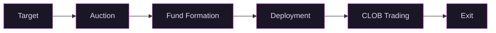

# How It Works

## The Private Beta

The platform launches with early access for Qualified Purchasers. This is the first phase: auctions, fund formation, and secondary trading on the CLOB.

### 1. Target

Vex identifies a venture-funded company and a target ownership percentage. Say 2% of FDV, which equals 2 million units in the 100M unit standard.

### 2. Auction

Qualified purchasers bid on units in a Dutch auction. The auction clears at a uniform price. This is demand aggregation: buyers come first, and the fund forms from their conviction.

### 3. Fund Formation

The auction creates a Series SPV. Cash raised is the fund's capital.

### 4. Deployment

[Vex Capital](https://adviserinfo.sec.gov) deploys the cash to acquire equity in the target company through both primary channels (buying directly from the company) and secondary channels (buying from existing shareholders, employees, and early investors who want liquidity). The company does not need to initiate anything. The demand side drives the process.

### 5. Secondary Trading

Once the Series holds equity, units trade on the CLOB. Price discovery is continuous. The [$240B secondary market](https://www.caisgroup.com/articles/whats-behind-the-recent-growth-in-private-markets-secondaries) exists because LPs need liquidity that traditional fund structures refuse to provide. Vex makes liquidity the default.

### 6. Exit

Sell units on the CLOB. Settlement is immediate. No lockup. No GP approval.

## The Full Platform

When a fund is fully allocated and trading actively, it graduates to the full platform. This is where the model reaches its potential.

**Broader access.** The QP minimum goes away. Accredited investors can participate. The addressable market expands from the roughly 2.75 million US qualified purchaser households to the estimated 24 million accredited investor households.

**Warehousing.** Existing shareholders of a company can convert their private shares into fund units. The fund issues new units as consideration, acquiring additional equity. The shareholder gets liquidity. The fund grows its position. No back-channel deal required.

**Governance markets.** Conditional unit classes tied to corporate decisions become available. Holders can express a thesis on specific governance outcomes, not just on the company. Management gets a real-time price signal on what the market thinks their decisions are worth.

**Public advertising.** The platform can actively market to investors instead of relying on pre-existing relationships. QPs still get early access to every new company through the private beta auctions before graduation.

## Fees

No carried interest. The fee is 1% per year, paid in unit dilution, starting 12 months after auction close.

That is the entire fee structure. One number. Compare that to the industry standard 2/20, where a 2% management fee compounds every year regardless of performance and 20% carry comes off the top of any gains.

Vex Capital covers fund expenses during the initial period. After the full platform launches, expenses come out of the 1%.
