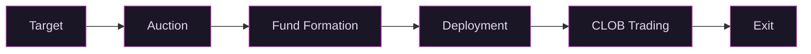

# How It Works

## The Private Beta

The platform launches with early access for Qualified Purchasers.

### 1. Target

Vex identifies a venture funded company and a target ownership percentage. Say 2% of FDV: 2 million units in the 100M unit standard.

### 2. Auction

Qualified purchasers bid in a Dutch auction. The auction clears at a uniform price. Buyers come first. The fund forms from their conviction.

### 3. Fund Formation

The auction creates a Series SPV. Cash raised is the fund's capital.

### 4. Deployment

[Vex Capital](https://adviserinfo.sec.gov) deploys cash to acquire equity in the target through primary channels (buying from the company) and secondary channels (buying from existing shareholders, employees, and early investors). The company does not need to initiate anything.

### 5. Secondary Trading

Once the Series holds equity, units trade on the CLOB. Price discovery is continuous. Holders can place sell orders at any time; execution depends on counterparty availability at an acceptable price.

### 6. Exit

Sell units on the CLOB to any qualified buyer. Settlement is immediate. No lockup. No GP approval.

## The Full Platform

When a fund is fully allocated and trading actively, it graduates to the full platform.

**Broader access.** The Qualified Purchaser minimum goes away. Accredited investors can participate.

**Warehousing.** Existing shareholders can convert private shares into tradeable fund units, as described in [The Vex Model](the-vex-model.html#warehousing). The fund issues new units as consideration, acquiring additional equity. The shareholder gets a liquidity opportunity. The fund grows its position.

**Governance markets.** Conditional unit classes tied to corporate decisions become available, as described in [Governance Without Board Seats](governance.html). Holders express a thesis on specific governance outcomes. Management gets a price signal.

**Public advertising.** The platform can market to Vex platform users instead of relying on pre-existing relationships. Qualified Purchasers still get early access to every new company through the private beta auctions before graduation.

## Fees

No carried interest. The fund management fee is 1% per year, paid in unit dilution, starting 12 months after auction close. Compare that to the industry standard 2/20: a 2% management fee compounding every year regardless of performance, plus 20% carry off the top of any gains.

When Vex Securities deploys capital to acquire equity for the fund (through secondary purchases or primary issuance), the broker dealer charges a 5% commission on the transaction. This is paid by the selling shareholder, not by fund investors.

ATS matching fees for secondary trading on the CLOB will be published before the platform opens for trading.

Vex Capital covers fund expenses during the initial period. After the full platform launches, expenses come out of the 1%.

*This document is for informational purposes only and does not constitute an offer to sell or a solicitation of an offer to buy any securities. Investing in private market securities involves substantial risk, including the possible loss of principal. Past performance is not indicative of future results. Liquidity depends on counterparty availability and is not guaranteed. Neither Vex Securities nor its affiliates facilitate the sale of tokenized units or make recommendations related to their use. Securities offered through Vex Securities LLC, Member FINRA/SIPC.*
