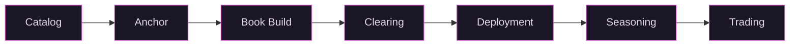

# How Vex Works

A position on Vex follows a seven stage lifecycle: from discovery in the catalog through an anchor commitment, open book build, clearing, deployment, seasoning, and secondary trading. Each stage is described below.

## Catalog

The platform maintains a catalog of hundreds of private companies. Each listing includes a research summary covering funding history, valuation, stage, and sector. Investors browse the catalog, search by sector or stage, and star companies to track interest. Content is maintained and updated as new information becomes available.

The catalog is discovery, not a recommendation. Inclusion does not imply endorsement, and research summaries are informational, not investment advice.

## Anchor

When an investor commits $1M or more to a company in the catalog, it triggers SPV formation. [Vex Capital](https://adviserinfo.sec.gov) structures a 3(c)(7) Series SPV with standardized documents: master PPM, series supplement, and subscription agreement. Cash is held in escrow until the anchor countersigns within a set deadline. If the anchor withdraws before countersigning, the commitment is released.

The legal standardization matters here. One entity type. One set of docs. One compliance framework. Each new company is a new Series, not a new fund. A new Series can be structured and documented in weeks, not months.

## Book Build

Once the SPV is structured and documents are ready, the deal opens to all qualified investors. The minimum bid is $10K. Each bid specifies a maximum fully diluted valuation (FDV) the investor is willing to pay.

Bids are binding and non-cancellable. Investors can raise their bid or place additional bids, but they cannot withdraw. A live demand curve shows aggregate interest: the x-axis is candidate clearing FDV, the y-axis is cumulative USD from bids at or below that FDV. Participation is pseudonymous. Identity is visible only to the operator and compliance.

The valuation standard is uniform across all Series. Every company is divided into 100 million units at FDV. One unit equals one hundred-millionth of FDV. There are no preference stacks and no liquidation waterfalls.

The tradeoff is real: you give up the downside protection of preferred terms. The argument is that continuous price discovery and liquidity are worth more than contractual protections that only matter when you cannot exit anyway.

## Clearing

The operator sets a cap on total raise (`finalized_max_usd`). The clearing algorithm sorts bids by max FDV descending and walks cumulative USD until the cap is reached. Bids above the clearing FDV are excluded and their cash holds are released. Bids at or below the clearing FDV are filled at the uniform clearing price. The marginal bidder may receive a pro-rata allocation if their bid would push cumulative USD past the cap.

The result: one price for all investors in the Series.

## Deployment

Vex Capital sources equity in the target company through secondary purchases from existing shareholders or primary issuance from the company. There are three possible outcomes.

**Full deployment.** Deployed capital meets or exceeds the target. All bidders receive their full allocation. Any overshoot is rebated pro-rata to investors.

**Partial deployment.** Deployed capital falls short of the target. All allocations are scaled down proportionally and the remainder is refunded.

**No deployment.** The operator marks the SPV as refunded. All cash holds are released and the SPV is wound down.

Settlement is recorded on the transfer agent registry operated by [Vex Registry LLC](https://www.sec.gov/cgi-bin/browse-edgar?company=vex+registry&CIK=&type=TA&dateb=&owner=include&count=40&search_text=&action=getcompany), the SEC registered transfer agent maintaining authoritative ownership records for all units on the platform.

## Seasoning

After deployment, units enter a 12 month holding period under SEC Rule 144. If the Series files Form 10 with the SEC, the holding period may be shorter. During seasoning, units cannot be traded. Investors should plan for the full 12 months of illiquidity.

## Trading

After seasoning, units become tradable on the ATS operated by [Vex Securities LLC](https://brokercheck.finra.org/firm/summary/317371) (CRD #317371, FINRA/SIPC member). The secondary market uses a continuous limit order book (CLOB). Holders can place sell orders at any time. Execution depends on counterparty availability at an acceptable price. There is no assurance of liquidity.

What trades on the ATS are units in the Series, not the underlying company equity. The Series holds the equity. Transfer restrictions live at the SPV level, not the unit level. Unit transfers carry no company level right of first refusal, no board approval, no notice period.

## Warehousing

Existing shareholders can convert private shares into fund units. The Series issues new units as consideration to acquire the shares. The shareholder gets tradable units with access to the secondary market. The fund increases its position in the underlying company.

The cost is the fund's 1% annual fee (see [Fees](#fees) below). For a shareholder sitting on restricted stock with no market, 1% is a fraction of the discount they would pay selling through secondary deals, which historically average 20% or more off NAV.

## Fees

The fund management fee is 1% per year, paid in unit dilution: 0.25% of outstanding units are issued to the operator at each quarter end, starting 12 months after the book build closes. There is no carried interest. Compare that to the industry standard 2/20: a 2% management fee compounding every year regardless of performance, plus 20% carry off the top of any gains.

When Vex Capital deploys capital to acquire equity for the fund (through secondary purchases or primary issuance), the broker-dealer charges a 5% commission on the transaction. This is paid by the selling shareholder, not by fund investors.

ATS matching fees for secondary trading will be published before the platform opens for trading.

Vex Capital covers fund expenses during the initial period.

*This document is for informational purposes only and does not constitute an offer to sell or a solicitation of an offer to buy any securities. Investing in private market securities involves substantial risk, including the possible loss of principal. Past performance is not indicative of future results. Liquidity depends on counterparty availability and is not guaranteed. Neither Vex Securities nor its affiliates facilitate the sale of tokenized units or make recommendations related to their use. Securities offered through Vex Securities LLC, Member FINRA/SIPC.*
