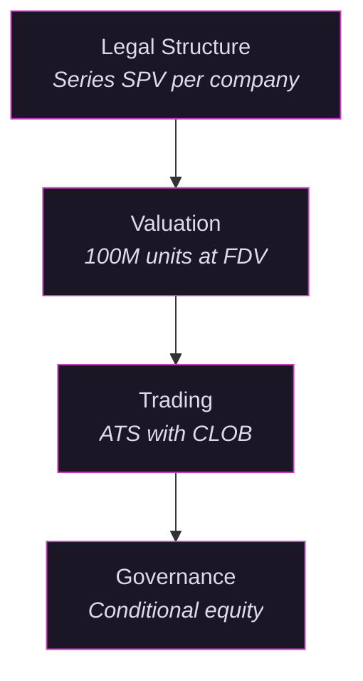
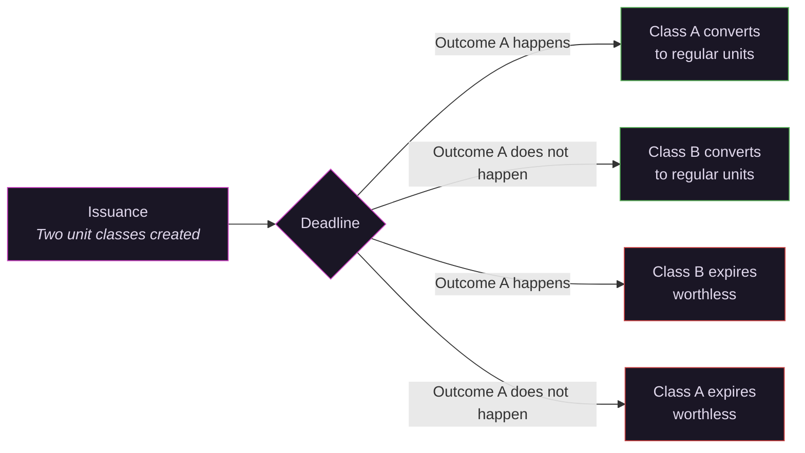

# The Vex Model

Vex standardizes four layers of the private equity stack.

## Legal Structure

Every position on Vex is a unit in a Series SPV (special purpose vehicle). Each Series holds equity in one private company. One entity type. One set of docs. One compliance framework.

New Series launch in weeks, not months. The structure scales horizontally: each new company is a new Series, not a new fund.

## Valuation

Every company is divided into 100 million units at fully diluted value ("FDV"). One unit equals one hundred millionth of FDV. A Series targeting 2% of FDV issues 2 million units.

Unit price reflects implied FDV. If units clear at $0.50, implied FDV is $50M. If $2.00, implied FDV is $200M.

No preference stacks. No liquidation waterfalls. No anti dilution provisions. One number, one unit, one price.

The tradeoff is real: you give up the downside protection of preferred terms. The argument: continuous price discovery and liquidity may be worth more than contractual protections that only matter in scenarios where you cannot exit anyway.

## Trading

Units trade on the SEC registered Alternative Trading System ("ATS") operated by [Vex Securities LLC](https://brokercheck.finra.org/firm/summary/317371) (CRD #317371, FINRA/SIPC member). Two mechanisms: Dutch auctions for demand aggregation and a continuous limit order book ("CLOB") for secondary trading. Settlement is atomic delivery versus payment.

What trades on the ATS are units in the Series, not the underlying company equity. The Series holds the equity. Transfer restrictions live at the SPV level, not the unit level. Unit transfers carry no company level right of first refusal, no board approval, no 90 day notice period.

Holders can place sell orders on the order book to any qualified buyer at any time. Execution depends on counterparty availability at an acceptable price.

## Governance

Conditional equity replaces traditional control rights.

Both sides of a governance question (e.g., "company pivots to B2C before Q4" versus "company does not pivot") are represented by conditional unit classes. Both are real equity denominated in the same 100M unit standard. If your outcome happens before the deadline, your units convert to standard regular units. If the other outcome happens, your units expire worthless.

The relative price of the two classes is the market's probability estimate and implied valuation under each scenario. Everyone is long the company. Nobody is short the equity. But holders can be short a particular decision.

Management gets a direct price signal on what the market thinks their decisions are worth. For a full walkthrough of how this works in practice and what it replaces, see [Governance Without Board Seats](governance.html).

## Warehousing

Existing shareholders of a company can convert their private shares into fund units. The Series issues new units as consideration to acquire the shares. The shareholder gets liquid, tradeable units on the CLOB with access to governance markets. The fund increases its position in the underlying company.

This is a conversion, not a sale. The shareholder moves from illiquid private stock with no exit to units with continuous price discovery. The cost is the fund's 1% annual fee (see [Fees](how-it-works.html#fees)). For a shareholder sitting on restricted stock with no market, that may be a fraction of the discount they would pay selling through secondary deals today, which can average 20% or more off NAV.

*This document is for informational purposes only and does not constitute an offer to sell or a solicitation of an offer to buy any securities. Investing in private market securities involves substantial risk, including the possible loss of principal. Past performance is not indicative of future results. Liquidity depends on counterparty availability and is not guaranteed. Neither Vex Securities nor its affiliates facilitate the sale of tokenized units or make recommendations related to their use. Securities offered through Vex Securities LLC, Member FINRA/SIPC.*
