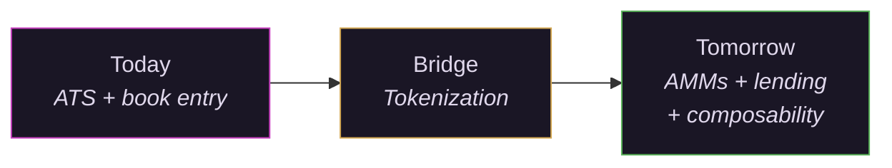

# What Comes Next

## What exists today

Units on the ATS are book entries maintained by Vex Registry, an SEC-registered transfer agent. Cash moves via Solana USDC and Mercury wire. Settlement happens at the transfer agent level. Every trade is a real transfer of ownership recorded in the authoritative ledger.

This is a functioning market. It works now.

## Tokenization is the bridge

The next step is representing those same units as on-chain tokens. Ownership remains authoritative at the transfer agent. The token is a portable representation, a receipt that can interact with other systems while the legal record stays where regulators expect it.

This is not a philosophical shift. It is a distribution upgrade. The same units, the same legal structure, the same compliance framework, but now readable by any system that speaks the token standard.

## What tokenization enables

**AMM liquidity supplementing the order book.** Automated market makers provide continuous liquidity for units that might otherwise sit idle between trades. The CLOB handles price discovery. The AMM handles availability. Both run simultaneously.

**Lending against tokenized units.** Private market margin lending without prime brokerage. If your units are tokenized and priced continuously, a lending protocol can accept them as collateral. This is the single largest unlock for institutional allocators who currently treat PE positions as dead capital.

**Composability.** Third parties bundle standardized units into indices, baskets, or structured products. When every position follows the same unit standard and the same legal structure, combining them is trivial. A "top 20 venture" basket becomes as simple to construct as an ETF.

**Cross-chain settlement.** Solana today. Portable to wherever liquidity concentrates tomorrow.

## The regulatory path is clearing

The [GENIUS Act](https://www.congress.gov/bill/119th-congress/senate-bill/1582), signed into law in 2025, provides federal clarity on stablecoin settlement. SEC custody modernization guidance issued in December 2025 addresses how registered entities can hold digital assets.

## The numbers

$33 billion in tokenized real world assets as of October 2025, with the [World Economic Forum projecting](https://www.weforum.org/stories/2025/08/tokenization-assets-transform-future-of-finance/) that tokenization will reshape how financial assets move globally. 11% of PE participants are actively considering tokenization of secondary interests.

Who builds the infrastructure that connects tokenization to real legal ownership, real compliance, and real settlement?
