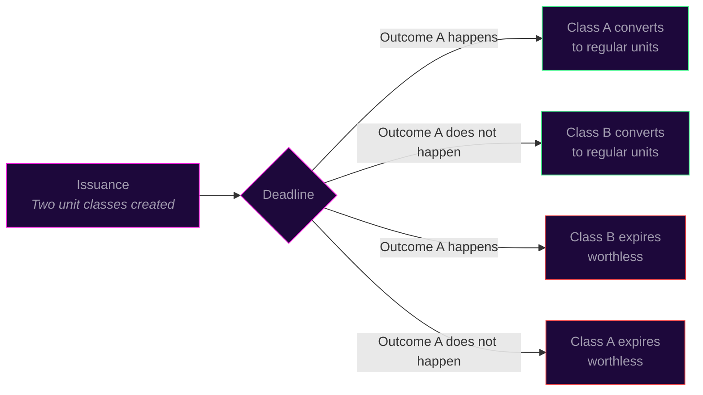
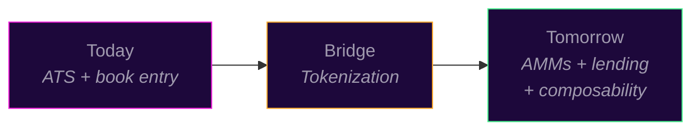

# What Comes Next

The ATS, catalog, and book build infrastructure described in [How Vex Works](how-vex-works.html) are operational today. Two additional capabilities are on the roadmap: governance through conditional equity and tokenization of fund units. Both build on the standardized SPV and trading infrastructure already in place. Neither is a current offering.

## Governance through conditional equity

Traditional private market governance relies on three mechanisms. Board seats go to the largest LPs and are limited by available seats. LP advisory committees are non binding: management can listen politely and do whatever they want. Side letters are bilateral, opaque, and create misaligned incentives across the investor base. The result is that a small number of large investors get an illusion of influence while management gets no actionable signal on what the broader market thinks.

Conditional equity replaces all three. Two conditional unit classes trade on the order book, each representing one side of a governance question. Both classes are real equity, denominated in the same 100M unit standard. If one outcome happens before the deadline, that class converts to standard regular units. The other class expires worthless. If the opposite outcome happens, the conversion reverses.

The relative price of the two classes encodes the market's probability estimate and implied valuation under each scenario. If "pivot" units trade at $1.20 and "no pivot" units trade at $0.80, the market is pricing a 60% probability that the pivot happens and pricing the company higher under that scenario. That is not an opinion. It is capital at risk.

Management gets something no board meeting can provide: a real time, dollar weighted signal on what the market thinks their decisions are worth. The price updates with every trade. Management does not need to commission surveys, parse advisory committee minutes, or guess whether the largest LP's objection represents the investor base or just one allocator's house view.

This is not a hostile governance tool. Everyone holding conditional units is long the company. Nobody is short the equity. Holders can disagree about a specific decision while remaining aligned on the company's success. The market resolves the disagreement.

This capability is under development. It is not a current offering. It involves additional risks, including the possibility that conditional units expire worthless if the specified outcome does not occur.

## What exists today

Units on the ATS are book entries maintained by Vex Registry, an SEC registered transfer agent. Cash moves via Solana USDC and Mercury wire. Settlement happens at the transfer agent level. Every trade is a real transfer of ownership recorded in the authoritative ledger.

## Tokenization is the bridge

The next step: representing those same units as on chain tokens. Ownership remains authoritative at the transfer agent. The token is a portable receipt that can interact with other systems while the legal record stays where regulators expect it.

This is a distribution upgrade, not a philosophical shift. Same units, same legal structure, same compliance framework, same fees, but now readable by any system that speaks the token standard. Tokenized units would remain subject to the fund's 1% annual management fee, and all transfers would settle through the ATS.

Neither Vex Securities nor its affiliates facilitate the sale of tokenized units or make recommendations related to their use. The descriptions below represent potential future capabilities, not current offerings.

## What tokenization would enable

**AMM liquidity supplementing the order book.** Automated market makers could provide continuous liquidity for units that sit idle between trades. The CLOB handles price discovery. The AMM handles availability. Both run simultaneously.

**Lending against tokenized units.** Continuously priced tokenized units could serve as collateral in lending protocols, giving institutional allocators a way to borrow against PE positions they currently treat as dead capital.

**Composability.** Third parties could bundle standardized units into indices, baskets, or structured products. When every position follows the same unit standard and legal structure, a "top 20 venture" basket becomes as simple to construct as an ETF.

**Cross chain settlement.** Solana today. Portable to wherever liquidity concentrates tomorrow.

## The regulatory path is clearing

The [GENIUS Act](https://www.congress.gov/bill/119th-congress/senate-bill/1582), signed into law in 2025, provides federal clarity on stablecoin settlement. SEC custody modernization guidance issued in December 2025 addresses how registered entities can hold digital assets. These developments create a more favorable environment for tokenized financial infrastructure.

## The numbers

$33 billion in tokenized real world assets as of October 2025, with the [World Economic Forum projecting](https://www.weforum.org/stories/2025/08/tokenization-assets-transform-future-of-finance/) that tokenization will reshape how financial assets move globally. 11% of PE participants are actively considering tokenization of secondary interests.

*This document is for informational purposes only and does not constitute an offer to sell or a solicitation of an offer to buy any securities. Investing in private market securities involves substantial risk, including the possible loss of principal. Past performance is not indicative of future results. Liquidity depends on counterparty availability and is not guaranteed. Neither Vex Securities nor its affiliates facilitate the sale of tokenized units or make recommendations related to their use. Securities offered through Vex Securities LLC, Member FINRA/SIPC.*
